# ✦ Astrolog Skills

**Professional astrology in plain English, powered by your own copy of
[Astrolog](https://www.astrolog.org/astrolog.htm)** — a set of agent skills for Claude Code, also usable in Google's
Antigravity CLI.

Charts, transits, harmonic charts and midpoint structures, research across thousands of charts with an honest chance
baseline, terminal and interactive HTML charts, traditions built from the books and courses you own, and readings in
plain language — local, free and editable down to every orb and meaning.

- 🔭 **Astrolog does every calculation** — charts verified against it to ±0.001°, places from its atlas (222,694 of
  them) with historically correct time zones.
- 🧠 **The agent reads, the toolkit computes** — every number in a reading comes from `astro`; every meaning comes from
  a tradition's files, never from the model's memory.
- ✏️ **Traditions are editable files** — orbs, rules and meanings — and you can build one from your own books, notes
  or courses.
- 🔒 **Everything stays on your computer** — your charts, your books and your readings.

## Contents

[✨ What you can say](#-what-you-can-say) · [📸 Previews](#-previews) · [🚀 Install](#-install) ·
[📚 Traditions](#-traditions-built-from-your-own-books) · [🎵 Harmonics](#-harmonics-and-midpoint-structures) ·
[🔬 Research](#-research-what-a-group-has-in-common) · [🧩 Profiles and packs](#-profiles-and-traditions) ·
[🧰 Commands](#-commands) · [📁 Your data](#-your-data-and-privacy)

## ✨ What you can say

| | You say… | What happens |
|---|---|---|
| 🛠️ | "Set up astrolog skills" | checks everything, offers to install the official Astrolog 8.00, shows the sky right now |
| 💾 | "Save my chart: 1 May 1990, 2:20 pm, Paris" | looks up Paris (coordinates, historical time zone) and saves the chart |
| 🪐 | "Show my chart with aspects" | a colour chart in your terminal, plus a tree per planet: its aspects, then its midpoints |
| 🎵 | "What are my strongest harmonics?" | scans a range of harmonics in your chart and ranks them by your midpoint structures (new or classic method) or planet groups — up to H360 and beyond |
| 📅 | "What's happening for me over the next three months?" | transits now, and a timeline of the coming ones with their exact dates |
| 🌀 | "Which harmonics are my transits activating this year?" | a timeline of every transit to your planets and midpoints, and the harmonic patterns transits complete — one click to that harmonic transit chart |
| ✍️ | "Write me a psychological reading" / "…read it vibrationally" | a grounded reading in that tradition, saved as Markdown |
| 🌐 | "Make me an HTML chart I can send to a client" | one offline file with a real wheel, a harmonic slider and the strongest harmonics |
| 🏛️ | "Read my chart the Hellenistic way" | your life area by area, with the next two years' timing — and a study page that explains every finding |
| ⏳ | "What's my year about?" / "When are my peak periods?" | annual profections, zodiacal releasing, and the transits that matter this year |
| 🔬 | "Are musicians stronger in the 7th harmonic?" | builds a set from Astro-Databank data and sweeps it against control charts |
| 📖 | "Add my Hellenistic book (or my course notes) to the tradition" | indexes it privately, page by page or section by section |
| 🔁 | "Update the Hellenistic rules from my new source" | drafts the changes, checks every rule against its cited page, asks before applying |
| ⚙️ | "Use sidereal Lahiri with whole-sign houses" | switches profile — every chart, table and reading follows |

**Skills:** `setup` · `chart` · `harmonics` · `forecast` · `report` · `research` · `export` · `packs`

## 📸 Previews

All for Einstein's chart — click any picture for the full size.

### 💻 In the terminal

`astro view …`, `astro harmonics …` — or just ask, and the agent shows them.

<table>
<tr>
<td width="33%" align="center" valign="top"><a href="docs/images/terminal-chart.png">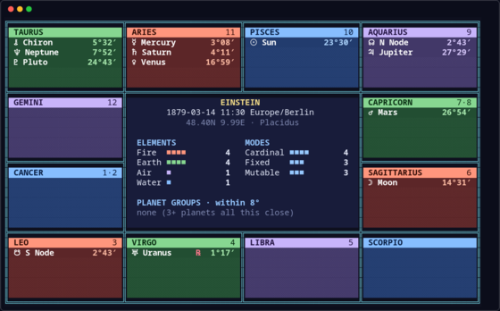</a><br><sub><b>The chart</b><br>planets in their signs, elements and modes</sub></td>
<td width="33%" align="center" valign="top"><a href="docs/images/terminal-aspects.png">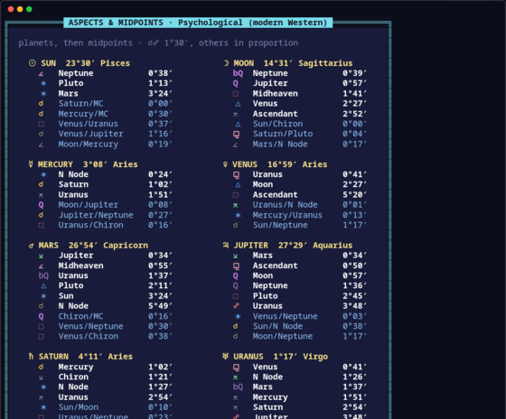</a><br><sub><b>Aspects and midpoints</b><br>a tree per planet</sub></td>
<td width="33%" align="center" valign="top"><a href="docs/images/terminal-harmonics.png">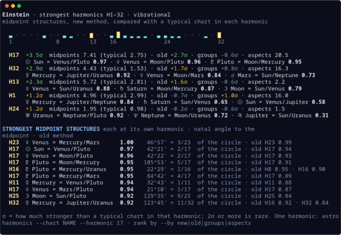</a><br><sub><b>Strongest harmonics</b><br>your chart's harmonics, ranked by midpoint structures</sub></td>
</tr>
<tr>
<td align="center" valign="top"><a href="docs/images/terminal-doctrine.png">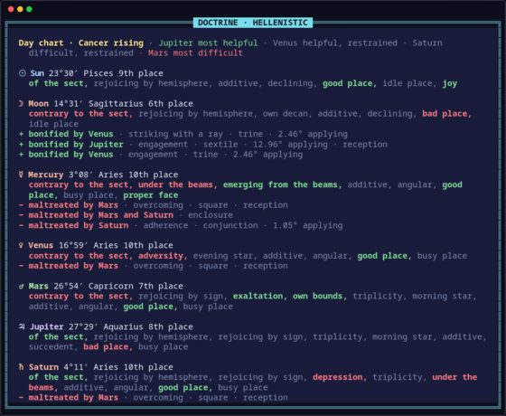</a><br><sub><b>Hellenistic doctrine</b><br>each planet's condition, and who helps or harms it</sub></td>
<td align="center" valign="top"><a href="docs/images/terminal-timelords.png">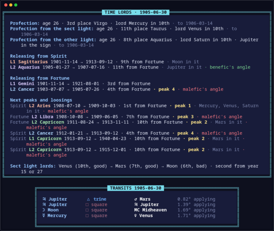</a><br><sub><b>Time lords</b><br>profections, releasing, peaks and transits on a date</sub></td>
<td align="center" valign="top"><a href="docs/images/terminal-transits.png">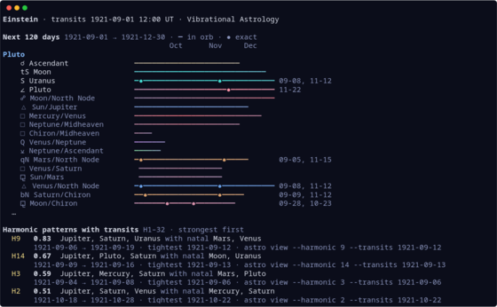</a><br><sub><b>Transit timeline</b><br>every transit, brightest on its exact days, then harmonic patterns</sub></td>
</tr>
<tr>
<td align="center" valign="top"><a href="docs/images/terminal-harmonic-transit-chart.png">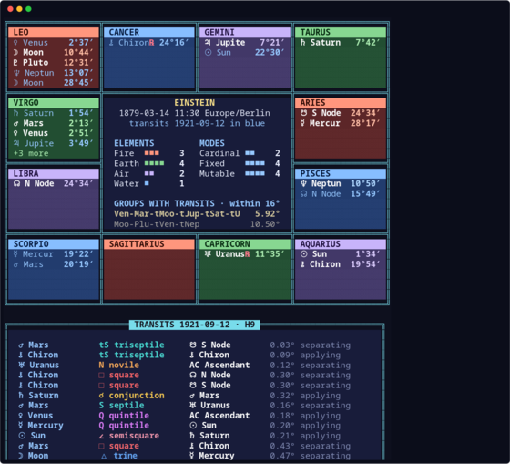</a><br><sub><b>Harmonic transit chart</b><br>natal and transiting planets × H, the groups they form</sub></td>
<td></td>
<td></td>
</tr>
</table>

### 🌐 As an interactive HTML page

`astro export html …` — one offline file that opens in any browser and can be sent to a client.

<table>
<tr>
<td width="50%" align="center" valign="top"><a href="docs/images/html-natal.png">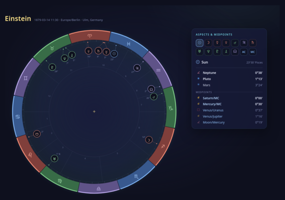</a><br><sub><b>Natal chart</b><br>the wheel, with aspects and midpoints per planet</sub></td>
<td width="50%" align="center" valign="top"><a href="docs/images/html-harmonics.png">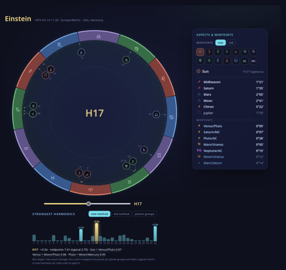</a><br><sub><b>Harmonics</b><br>a slider through the harmonic charts, the strongest ranked below it</sub></td>
</tr>
<tr>
<td align="center" valign="top"><a href="docs/images/html-transits.png">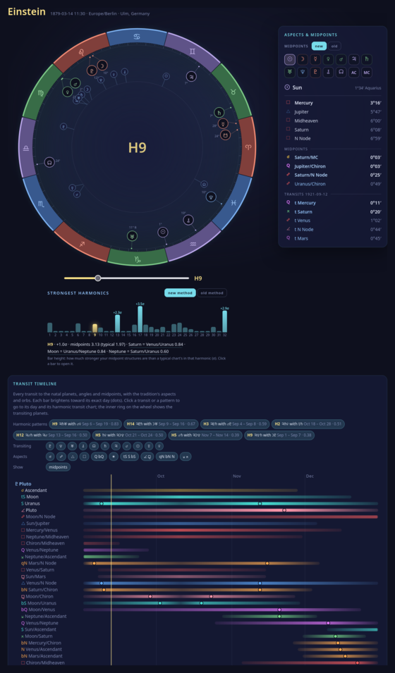</a><br><sub><b>Transits</b><br>a transit timeline with harmonic patterns; click one to see its harmonic transit chart</sub></td>
<td align="center" valign="top"><a href="docs/images/study-page.png">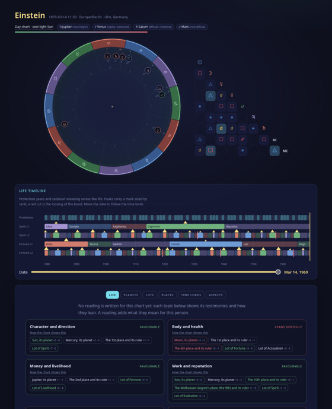</a><br><sub><b>🏛️ Hellenistic study</b><br>the reading's evidence: wheel, life timeline, topics — plus planets, lots, places and time lords in tabs</sub></td>
</tr>
</table>

## 🚀 Install

| You need | |
|---|---|
| 💻 **macOS, Linux or Windows** | Windows support is untested so far |
| 📦 **[uv](https://docs.astral.sh/uv/)** | runs the toolkit; it fetches Python itself |
| 🔭 **Astrolog** | the setup skill finds yours, or installs the official release (on macOS and Linux it builds it, which needs a C++ compiler and `make`; on Windows it unpacks the official program) |

Full details and optional tools: [docs/install.md](docs/install.md).

### Claude Code

```
curl -LsSf https://astral.sh/uv/install.sh | sh                  # once, in a terminal (macOS, Linux)
powershell -c "irm https://astral.sh/uv/install.ps1 | iex"       # once, in PowerShell (Windows)
```

Then, in Claude Code (on Windows it runs commands through Git Bash, which comes with Git for Windows):

```
/plugin marketplace add 0xctx/astrolog-skills
/plugin install astrolog-skills@astrolog-skills
```

Say **"set up astrolog skills"**. Commands shown as `! astro …` are typed at Claude Code's prompt to see colour
views; Claude runs everything else itself.

### Google Antigravity CLI (`agy`)

Antigravity loads the same skills. The skills drive a command-line toolkit, `astro`, so it goes on your PATH too.

**macOS and Linux**

```
curl -LsSf https://astral.sh/uv/install.sh | sh                         # uv runs the toolkit
git clone https://github.com/0xctx/astrolog-skills.git ~/astrolog-skills
mkdir -p ~/.local/bin && ln -s ~/astrolog-skills/bin/astro ~/.local/bin/astro   # the `astro` command
agy plugin install ~/astrolog-skills                                    # the skills
```

**Windows** (PowerShell; untested so far)

```
powershell -c "irm https://astral.sh/uv/install.ps1 | iex"
git clone https://github.com/0xctx/astrolog-skills.git $HOME\astrolog-skills
[Environment]::SetEnvironmentVariable("Path", [Environment]::GetEnvironmentVariable("Path", "User") + ";$HOME\astrolog-skills\bin", "User")
agy plugin install $HOME\astrolog-skills
```

The third line puts the `astro` command on your PATH; open a new terminal afterwards.

Start `agy` and say **"set up astrolog skills"**. Where the skills mention `! astro …`, run the command without the
`!` in your own terminal — colour views need a real terminal. To update: `git pull` in the clone, then install the
plugin again.

## 📚 Traditions built from your own books

Add what you study to a tradition, and the agent builds the tradition's rules from it — which zodiac and houses it
uses, what makes a chart diurnal, the dignity tables, the conditions that help or harm a planet, the lots, the
places, the timing techniques. Each rule is checked against the place it comes from:

| Source | Cited by |
|---|---|
| 📕 a book — PDF or text; scanned PDFs too, read by OCR when `ocrmypdf` is installed | its printed page |
| 📝 your notes — `.md`, `.txt` | the section's heading |
| 🎧 a course transcript — `.txt`, `.srt`, `.vtt` | its lesson and timestamp ("Lesson 3, 41:10") |
| 🌐 a web page — its address | the section's heading |

Readings leave citations out unless you ask for them (`astro --cite …`, or
`astro config set readings.citations true`).

- 🔒 **Your books stay private.** The text and its search index live only in
  `~/.astrolog-skills/traditions/<pack>/sources/`. They never go into the plugin, a repository or an export, and the
  pack's own files are written in fresh words. `scripts/check_source_privacy.py` scans a repository and its whole
  history for any passage of your books.
- ✅ **Checked, not trusted.** `astro packs verify` confirms that each rule's supporting words are really on the page it
  cites (and names the right page when they aren't), that tables pass their own consistency checks (a sign's bounds
  cover 30°, the planets' totals add up), that nothing copies the source's wording, and that lots match Astrolog's
  own. With several sources it shows which rules more than one of them supports. Anything a source leaves open goes
  into `REVIEW.md` as a question for you. Nothing is applied until you approve the diff.
- 🏛️ **Hellenistic comes built in.** A sample pack of the tradition's common doctrine (`traditions/hellenistic/`) lets
  you try every technique without a book. It carries no page citations; add your own books or courses and the agent
  starts from it to build a version cited page by page, which then replaces it on your computer.
- 💬 **Readings for people, not textbooks.** Readings speak plainly about work, money, love, family, health and
  timing, with practical guidance and a dated two-year forecast; the technique behind each statement is one click
  away on the study page.

<details>
<summary><b>What the Hellenistic tradition computes</b></summary>

| Area | Techniques |
|---|---|
| ☀️ Sect | day and night charts, rejoicing, Mercury's role by association |
| 👑 Dignities | domicile, exaltation, triplicity, bounds, decans, twelfth-parts, proper face |
| 🌅 Solar phase | under the beams, chariot, morning and evening stars, heliacal rising |
| 🏠 Places | whole-sign places, angular triads, good, bad and busy places (including a declining planet made busy by an angle's degree), joys, the Midheaven and IC degrees' places, quadrant houses for reference, rulers of the places |
| 🔗 Configurations | by sign, overcoming, aversion, assembly |
| ⚖️ Condition | bonification and maltreatment — overcoming, opposition and trine, counteraction, enclosure, containment, adherence, striking with a ray, engagement — with reception; the Moon running in the void |
| 🎯 Lots | every formula variant and the lot checklist (the Marriage lot by the native's sex) |
| 🧭 Topics | life topics judged by their three testimonies |
| ⏳ Timing | annual profections, the sect light's triplicity lords, zodiacal releasing with peaks, the loosing of the bond and the period ruler's sign, transits read through the time lords |

</details>

### ➕ Add to a tradition at any time

A tradition grows with what you study:

1. **Add a source.** Tell the agent, e.g. *"add ~/Books/hellenistic-astrology.pdf to my Hellenistic tradition"*,
   *"add my lesson notes"* or *"add this course transcript"* — or by hand:
   `astro sources add hellenistic ~/Courses/lesson-03.srt`. The file is copied into the pack's private `sources/`
   folder and indexed (a plain copy into the folder isn't indexed).
2. **Update the rules.** Ask the agent to *"update the Hellenistic rules from my new source"*. It drafts a new version
   of the pack:
   - what the source confirms gets cited;
   - what it adds (new lots, conditions, timing variants, meanings, reading steps) is written in;
   - where it disagrees, the question goes to `REVIEW.md` for you to decide.

   The first time, it starts from the built-in pack; after that, from yours.
3. **Check and approve.** `astro packs verify hellenistic` checks every citation, and `astro packs diff hellenistic`
   shows what changed. Nothing changes until you say yes (`astro packs apply hellenistic --yes`), and the previous
   version is kept in `.history/`. Your own edits to the pack are kept too: a new draft starts from them, and the
   diff warns if it would change one.

Readings and forecasts then search all of the pack's sources. Add as many books, courses and notes as you like; each
one stays on your computer.

## 🎵 Harmonics and midpoint structures

A harmonic chart multiplies every position by a number, so relationships the eye can't see in the birth chart —
sevenths, ninths, seventeenths — show up as planets coming together. Two kinds of pattern count:

| Pattern | How it's measured |
|---|---|
| **Two-planet aspects** | planets close together in a harmonic chart (the vibrational pack's pair score) |
| **Midpoint structures, classic method** | a planet on the midpoint of two others, with the midpoint taken inside the harmonic chart |
| **Midpoint structures, newly proposed method** ([video](https://www.youtube.com/watch?v=qKB9QV43X_E)) | the angle to the midpoint measured in the birth chart and multiplied, so each structure has one strength and one harmonic of its own — e.g. "the Moon is 1/18 of the circle from the Sun/Saturn midpoint: 18th harmonic, 0.80" |
| **Planet groups** | 3 or more planets all together in a harmonic chart — the rare 4-planet groups of the high harmonics (H100–H360) |

- 🏆 `astro harmonics --chart Me` scans a range of harmonics in **your chart only** (H1–32 unless you pick others)
  and ranks them by the strength of your midpoint structures in each. The score is shown as σ: how much stronger
  than a typical chart in that same harmonic (2σ or more is rare), so harmonics are compared fairly with each other.
  Comparing groups of people is a separate tool: [research](#-research-what-a-group-has-in-common).
- ⚖️ Choose the scoring: `--by new` (the newly proposed method, the vibrational pack's default), `--by old` (the
  classic method), `--by groups` (planet groups) or `--by aspects` (two-planet aspects only) — or just ask, e.g.
  *"rank my harmonics by the old method"*. The other measures are always shown alongside.
- 🔭 **High harmonics:** the new method counts each structure once, at the lowest harmonic where it's within its 3°
  orb, and every angle is that close to a conjunction somewhere by H120 (360 ÷ 3) — so a range beyond that
  (`--harmonics 1-360`) ranks by planet groups instead. Each group is flagged when it holds the Moon and needs an
  exact birth time, or is mostly outer planets and so shared by a whole generation.
- 🔍 `--harmonic 17` shows one in detail; `--harmonics 1,5,7,18` picks your own range.
- 🌀 **Transits and harmonics:** `astro transits --chart Me --days 180` draws a timeline of every transit to your
  natal planets, angles and midpoints — with the tradition's own bodies, aspects and orbs — grouped by transiting
  planet, each bar brightest on its exact days (retrograde passes included). The aspect says which harmonic it
  belongs to: a septile is a 7th-harmonic transit. Below it, the **harmonic patterns** transits complete, scored 0–1
  like any pattern (transiting Saturn joining a natal Venus–Mars septile is an H7 pattern), each with the command for
  its **harmonic transit chart**: `astro view --chart Me --harmonic 7 --transits DATE`, natal and transiting planets
  both multiplied by 7. Narrow it with `--transiting saturn,ceres`, `--aspects h7,h9` or `--no-midpoints`; add
  asteroids with `--points +ceres,+pallas`. `astro export html … --transits DATE` puts the timeline and the harmonic
  transit chart on one page.

## 🔬 Research: what a group has in common

Research answers one question: **do the people (or events) in this group share something astrological, more than
chance would give?**

Say you think musicians tend to be strong in the 5th harmonic. Give it 300 musicians with reliable birth times
(`astro set create musicians …`) and run `astro research sweep musicians --range 1-180`. It:

1. 📏 **Measures every chart in every harmonic** you asked for, three ways: its midpoint structures by the newly
   proposed method and by the classic one, and its two-planet aspects (the same measures `astro harmonics` uses).
2. 🎲 **Builds comparison charts** by mixing the group's own birth years, days, times and places: real skies from
   comparable moments that belong to nobody. They show what the measures look like by pure chance.
3. 📊 **Reports where the group stands out** — e.g. "H5 is 1.3× stronger than chance; the odds of luck are about 1 in
   50" — or that **nothing stands out**, which is a real answer too. Odds are adjusted for testing many harmonics at
   once, so one of 180 looking "special" by luck isn't reported as a finding. It also says which measure separates
   the group from chance — a direct test of the new midpoint method against the classic one.
4. 🔎 **Names the charts that show it most**, so you can open them and study the pattern yourself, and lists each
   chart's own standout harmonics.

- **Use it to** test an idea from a book or your own practice before relying on it, discover which harmonics light up
  for a profession, a type of event or your own clients, or — with `--control OTHER-SET` — see two groups side by
  side.
- **Runs** are saved and repeatable (`astro research list`, `research show RUN`).
- **Data:** your saved charts, a CSV, or Astro-Databank (your own licensed copy or its free sample,
  `astro data fetch-sample`).

It doesn't interpret anyone's chart (that's a reading); it finds what a group shares. Results are leads to study, not
proof.

## 🧩 Profiles and traditions

Two kinds of settings shape every chart and reading:

| | Decides | Built in |
|---|---|---|
| 🔭 **Profile** (`profiles/<name>.toml`) | *how the sky is measured*: the zodiac (tropical, or sidereal with one of 9 verified ayanamsas), one of 23 house systems, the true or mean node, and which planets, asteroids and points are shown | `default`, `whole-sign`, `vedic-lahiri`, `vibrational` — `astro profile use NAME` |
| 📜 **Tradition pack** (`traditions/<name>/`) | *how the chart is read*: `method.toml` the rules the toolkit computes; `meanings.md` what things mean; `process.md` the steps of a reading; `sources.toml` where it all comes from; `REVIEW.md` the open questions | `psychological`, `vibrational`, `hellenistic` — `astro packs copy NAME` |

Your copy of a pack replaces the built-in one — edit it and the charts, tables and readings follow.

**A pack can carry its own chart settings.** A tradition often has a view on how the sky is measured — the
Hellenistic pack uses the tropical zodiac, whole-sign houses, the mean node and the seven visible planets. A pack's
`[chart]` section says so, and those settings apply whenever the pack is used, over your profile. You stay in
charge:

```
astro --houses placidus --points +ceres,+chiron view --chart Me --pack hellenistic   # try it once
astro packs settings hellenistic --zodiac lahiri                                    # keep it for this tradition
astro packs settings hellenistic --reset                                            # back to the pack's own
astro view --chart Me --pack hellenistic --profile default                          # exactly your profile
```

`--points` takes a list (replaces), `+name` (adds) or `-name` (drops). The zodiac and ayanamsa move every position;
the house system changes the wheel and house positions, while a traditional pack's own place rules (such as
whole-sign places) stay as its source teaches. A pack with doctrine always keeps the seven planets.

## 🧰 Commands

The agent runs these for you; they're yours to use too. Put `--json` (for the agent) or `--plain` before any command
(`astro --json transits --chart Me`); colour views are for a real terminal.

<details>
<summary><b>Command reference</b></summary>

```
astro doctor | astro astrolog install [--yes] | astro config show | astro config set location "48N24 10E00" --name Ulm
astro place "Ulm, Germany"
astro chart add NAME --date 1879-03-14 --time 11:30 --place "Ulm, Germany" [--rating AA] [--tag client] [--sex male|female]
astro chart list | show NAME | rm NAME
astro view --chart NAME [--show chart,aspects,grid,balance,patterns,positions|all] [--harmonic 7] [--transits now] [--midpoints new|old]
astro cast --chart NAME | --date … --time … --place "…" | --now
astro aspects --chart NAME [--harmonic H] | astro patterns --chart NAME --pack vibrational [--range 1-32]
astro harmonics --chart NAME [--harmonics 1-32 | 1,5,7,18] [--by new|old|groups|aspects] [--harmonic 17] [--orb-base 4]
astro transits --chart NAME [--on 2027-03-01] [--days 180] [--transiting saturn,ceres] [--natal sun,asc] [--aspects h7,septile] [--no-midpoints] [--harmonics 1-32]
astro report-data --chart NAME [--pack vibrational --pack psychological] [--on DATE]
astro export html --chart NAME [--harmonic 7 | --harmonics 1-12 | --harmonics 1,5,7,11] [--midpoints new|old] [--transits DATE --days 180] [--out file.html]
astro data fetch-sample | astro data categories --grep music
astro set create NAME --adb FILE|--csv FILE|--chart A --chart B [--rating AA,A] [--category "Vocation : …"]
astro set list | show NAME | cast NAME
astro research sweep SET [--range 1-180] [--measures new,old,aspects] [--control SET] | research list | research show RUN
astro profile list | show | use NAME | new NAME --from default
astro packs list | show NAME | copy NAME [--as NEW] | check [NAME]
astro packs settings PACK [--houses H] [--zodiac Z] [--node N] [--points +x,-y] [--reset]
astro --houses H --zodiac Z --points +x,-y --cite <any command>   # this command only
astro sources add PACK FILE|URL | list PACK | search PACK "words" | page PACK N|"41:10"|"heading" | render PACK N
astro packs outline PACK | draft PACK | verify PACK [--live] | diff PACK | apply PACK --yes | discard PACK
astro doctrine --chart NAME --pack P [--show life,planets,testimony,conditions,lots,places|all]
astro timing profections|lords|transits|releasing|search --chart NAME --pack P [--on DATE] …
astro view --chart NAME --pack P --show life,doctrine,lots,timelords
astro notes keys|check --chart NAME --pack P [--on DATE]
astro theme list | copy default --as mine | use mine
astro raw [--chart NAME] -- <any Astrolog switches>
```

Harmonic views show orbs as measured in the harmonic chart; `astro config set display.orbs natal` shows them in natal
degrees (÷ H) instead, in the terminal and in HTML exports.

</details>

## 📁 Your data and privacy

- 📁 **Everything that's yours** lives in **`~/.astrolog-skills/`** (`ASTROLOG_SKILLS_HOME` moves it): `config.toml`,
  `profiles/`, `charts/`, `sets/`, `data/`, `traditions/`, `presets/`, `themes/`, `exports/`, `research/`, `cache/`.
  Plugin updates never touch it.
- 🔒 **Everything runs on your computer.** What you type to your agent — including chart details — becomes part of
  that conversation with its model provider, like anything else you type there.
- 📦 **No astrology databases ship with this project.** Astro-Databank files are only imported from your own licensed
  copy or its free public samples, for your own research.

---

<sub>MIT licensed · Astrolog is not bundled · credits and notices in [NOTICE.md](NOTICE.md) · contributing:
[CONTRIBUTING.md](CONTRIBUTING.md)</sub>
